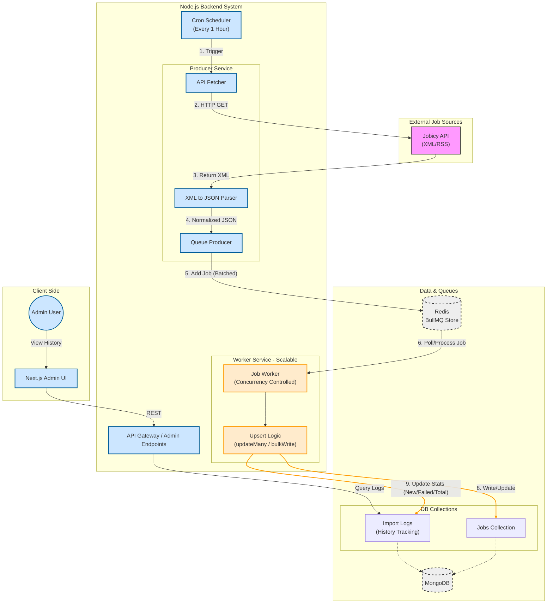

# System Architecture – Scalable Job Importer

## 1. Overview

This system is designed to **reliably ingest large volumes of job data** from multiple external XML-based APIs, process them asynchronously using a queue-based architecture, store deduplicated records in MongoDB, and maintain a detailed **import history audit trail**.

The architecture focuses on:
- Scalability
- Fault tolerance
- Clear separation of responsibilities
- Future extensibility (microservices-ready)

---

## 2. High-Level Architecture



---

## 3. Core Components

### 3.1 Cron Scheduler

- Uses **node-cron**
- Runs every **1 hour**
- Responsible only for:
  - Triggering feed fetch
  - Creating import log entries
  - Enqueuing jobs

> Cron does NOT perform heavy processing.  
> This prevents blocking and improves reliability.

---

### 3.2 Feed Fetch Service

Responsibilities:
- Fetch XML data from external APIs
- Convert XML → JSON
- Normalize job payload
- Create one **import log per feed per run**
- Push each job into Redis queue

Design choice:
- Fetching and processing are separated to keep the cron lightweight.

---

### 3.3 Redis Queue (BullMQ)

Why BullMQ:
- High throughput
- Redis-backed persistence
- Built-in retry & backoff
- Supports concurrency

Queue behavior:
- Each job record becomes one queue task
- Retry attempts configurable
- Failed jobs are logged into import history

---

### 3.4 Worker System

- Workers consume jobs from Redis
- Concurrency controlled via environment variable
- Each worker:
  - Validates job payload
  - Performs MongoDB upsert
  - Updates import log counters

Failure handling:
- Duplicate key errors are safely ignored
- Unexpected errors are recorded in `failedJobs`

---

## 4. MongoDB Design

### 4.1 Jobs Collection

Purpose:
- Store deduplicated job records

Deduplication strategy:
```js
{ source, externalJobId }

db.jobs.createIndex(
  { source: 1, externalJobId: 1 },
  { unique: true }
)
```
## Update logic:

New job → insert

Existing job with changed hash → update

Existing job with same hash → skip

This ensures idempotent imports, even with repeated cron runs.

## 4.2 Import Logs Collection (importlogs)

Purpose:

Full audit trail of every import execution

One document is created:

Per feed

Per cron run

Fields:

feedUrl

startedAt

finishedAt

totalFetched

newJobs

updatedJobs

failedJobs[]